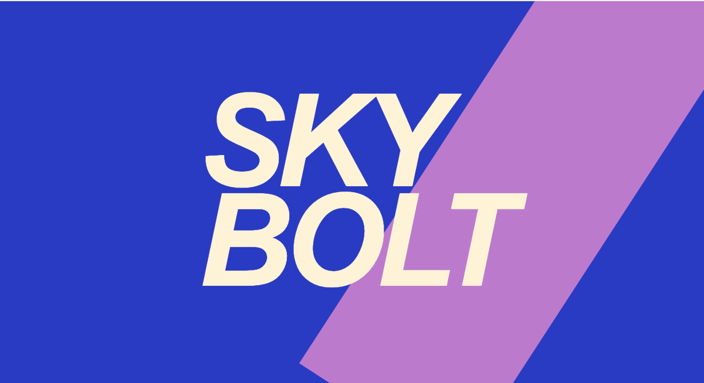
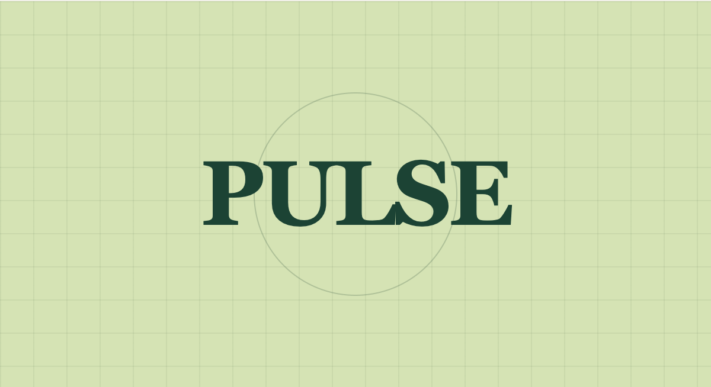
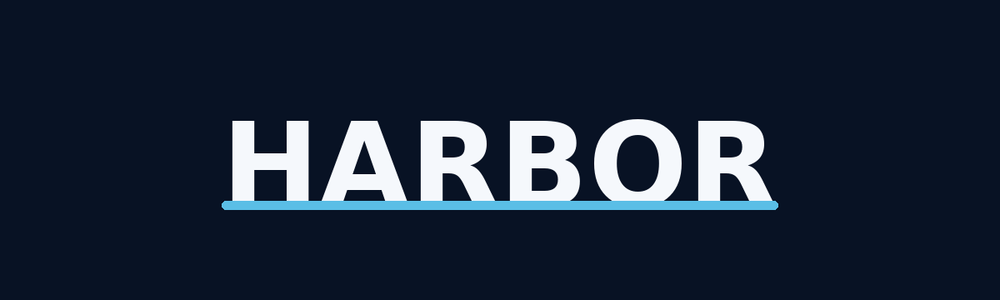

# Portfolio wordmarks · 作品集字标

Ray Qin’s approved portfolio identity studies, exported for repository headers and project documentation. These are brand graphics, not product screenshots or final App Store icons.

| SkyBolt | Pulse |
| --- | --- |
|  |  |
| Windpost | Harbor |
|  |  |
| Private custom software | |
|  | |

- PNG exports: 1200 × 654 px (Harbor wordmark 1200 × 360). Preserve the original aspect ratio; use a 480–600 px display width in a README.
- Editable source: [source.html](source.html), using [portfolio.css](../portfolio.css). Open on a wide viewport. The source contains only artwork, with no external fonts or images.
- Re-export from the maintained studio source with `node scripts/export-brand.mjs` (Chrome + the repository’s Playwright dependency).
- The public website repository is the shared distribution location. Product repositories can keep a versioned copy under `docs/brand/` so their READMEs work independently.
- Life Garden’s portfolio image is a development screenshot, not a logo; it is intentionally not included in this wordmark set.
- Windpost / 风邮小队 is the owner-confirmed game in qinjianxyz/windpost. Earlier website references to Windsor were a naming error; use Windpost in current material. The existing W monogram remains a website identity study, not an approved app icon.
- Harbor is Ray’s private growth / sales ops demo (customer #1); wordmark pairs with the AppIcon H mark in `qinjianxyz/harbor`.

These assets do not grant rights to the project names or trademarks. Review app icons separately before any store submission.
